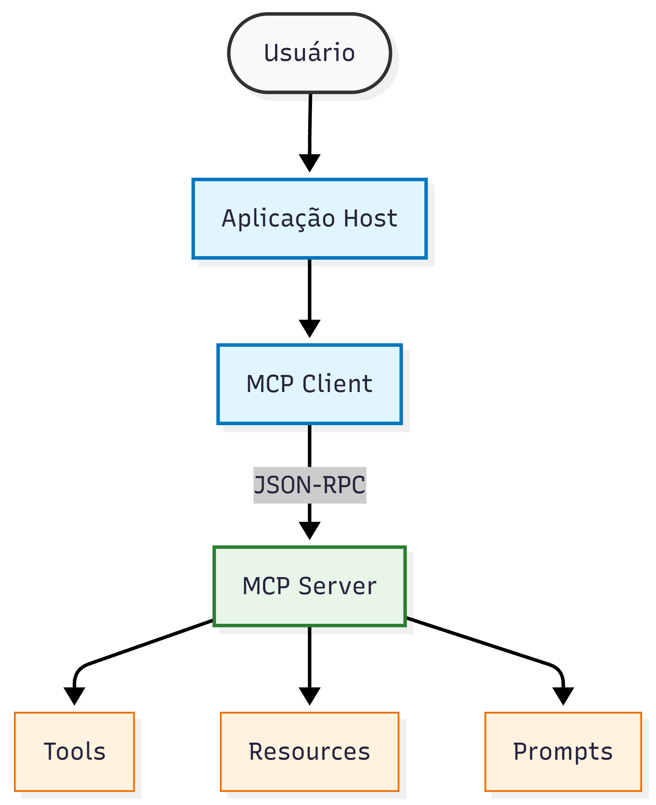

# 📘 Miniguia de Estudos: Model Context Protocol (MCP) com NotebookLM


<p align="center">
  
</p>

> Projeto desenvolvido como parte do desafio da DIO, utilizando o NotebookLM como ferramenta de aprendizagem ativa para estudar o **Model Context Protocol (MCP)** por meio da curadoria de fontes, engenharia de prompts e organização do conhecimento.

---

## 📑 Sumário

- [Sobre o Projeto](#-sobre-o-projeto)
- [Objetivos](#-objetivos)
- [O que é o Model Context Protocol?](#-o-que-é-o-model-context-protocol)
- [Curadoria de Fontes](#-curadoria-de-fontes)
- [Metodologia de Estudo](#-metodologia-de-estudo)
- [Engenharia de Prompts](#-engenharia-de-prompts)
- [Cicatrizes (Troubleshooting)](#-cicatrizes-troubleshooting)
- [Resumo Estruturado](#-resumo-estruturado)
- [Glossário](#-glossário)
- [Prompts Reutilizáveis](#-prompts-reutilizáveis)
- [Principais Aprendizados](#-principais-aprendizados)
- [Próximos Passos](#-próximos-passos)
- [Referências](#-referências)

---

# 📖 Sobre o Projeto

Este projeto tem como objetivo explorar o **Model Context Protocol (MCP)** utilizando o NotebookLM como ferramenta de apoio ao aprendizado.

Durante o estudo foram utilizados documentos técnicos oficiais para compreender a arquitetura do protocolo, seu funcionamento, aplicações práticas, limitações e boas práticas de implementação.

Além da pesquisa, foram registrados os testes de prompts, dificuldades encontradas e estratégias utilizadas para melhorar a qualidade das respostas obtidas pela IA.

---

# 🎯 Objetivos

- Compreender o funcionamento do Model Context Protocol.
- Identificar os componentes da arquitetura.
- Entender como ocorre a comunicação entre clientes e servidores MCP.
- Estudar casos de uso reais.
- Conhecer as vantagens e limitações do protocolo.
- Criar um material de consulta para estudos futuros.
- Documentar todo o processo de aprendizagem utilizando IA.

---

# 🧩 O que é o Model Context Protocol?

### O Model Context Protocol (MCP)

**Definição**
* **O que é:** Protocolo de código aberto padronizado que integra aplicações baseadas em LLMs a fontes de dados ou ferramentas externas.
* **Comunicação:** Utiliza mensagens no formato JSON-RPC 2.0 para estabelecer conexões com conservação de estado (stateful).
* **Arquitetura:** Estruturada em três partes: os Hosts (aplicações de IA que iniciam a conexão), os Clients (conectores internos) e os Servers (serviços externos).
* **Capacidades Principais:** Um servidor MCP oferece à IA três recursos: Tools (ferramentas de ação), Resources (dados de contexto) e Prompts (templates de mensagens).

---

**Origem**
* **Criador:** Desenvolvido pela Anthropic e rapidamente adotado como padrão na indústria de IA.
* **Inspiração:** Baseado no Language Server Protocol (LSP), que padronizou o suporte de linguagens de programação no desenvolvimento de software.

---

**Motivação**
* **Dificuldade histórica:** Anteriormente, integrar LLMs a ferramentas exigia a escrita de códigos exaustivos para gerenciar diferentes APIs, autenticações e documentações.
* **O "USB-C da IA":** A intenção foi criar um padrão universal para agentes de inteligência artificial, conectando qualquer modelo a qualquer ferramenta com o mínimo de fricção.

---

**Problema que Resolve**
* **Fim da fragmentação:** Resolve o isolamento dos modelos de IA e padroniza o ecossistema de integrações.
* **Abstração de APIs:** A IA não precisa "saber programar" para APIs específicas (como ClickUp ou Obsidian); ela apenas pede que o servidor MCP execute a ação.
* **Fim do copiar e colar:** Usando os Resources, a aplicação injeta os dados necessários diretamente no modelo, contornando processos complexos de vetorização (RAG) feitos do zero.

---

**Principais Benefícios**
* **Agência no Mundo Real (Tools):** A IA deixa de ser apenas geradora de texto e ganha capacidade de acionar ferramentas autonomamente (ex: rodar queries SQL, gerenciar Docker, consultar sites ou alterar arquivos locais).
* **Desempenho Local (STDIO):** Permite rodar servidores locais via transporte STDIO (Standard Input/Output), comunicando-se diretamente pelos processos do computador com virtualmente zero latência de rede.
* **Acessibilidade Remota (SSE):** Suporta também a criação de servidores remotos via rede utilizando HTTP com Server-Sent Events (SSE).
* **Segurança Baseada no Usuário:** Impede que a IA interaja livremente com o sistema. O protocolo exige que o usuário aprove as ações das ferramentas, protegendo dados sensíveis.
* **Gestão de Prompts:** Elimina o trabalho manual de procurar ou reescrever comandos através da criação de templates dinâmicos e pré-configurados dentro do próprio servidor.

---

# 📚 Curadoria de Fontes

## Fontes utilizadas

| Fonte | Tipo | Objetivo |
|--------|------|----------|
| https://modelcontextprotocol.info/docs/ | Documentação Oficial | Entender o protocolo |
| https://modelcontextprotocol.io/specification/2025-11-25 | Especificação Técnica | Arquitetura |
| https://modelcontextprotocol.io/docs/develop/build-server | Guia de Implementação | MCP Server |
| https://modelcontextprotocol.info/docs/best-practices/ | Guia de Boas Práticas | Arquitetura e Produção de Servidores |
| https://modelcontextprotocol.io/docs/tutorials/security/security_best_practices | Artigo Técnico | Segurança |
| https://www.youtube.com/watch?v=GuTcle5edjk | Vídeo Tutorial | Aplicação prática e criação com Docker |
| https://www.youtube.com/watch?v=gc9MEMdOZxM | Vídeo Aula | Visão geral, arquitetura e uso para Devs |

### Justificativa

Por que essas fontes foram escolhidas?
A seleção foi feita para criar uma trilha de aprendizado 360º e progressiva. Em vez de focar apenas na teoria abstrata ou apenas em tutoriais de código, esse conjunto de links cobre todo o ciclo de vida do desenvolvimento com MCP: desde o entendimento do conceito básico até a implementação prática, escalabilidade e segurança em ambientes reais.

Como contribuíram para o aprendizado:
Documentação e Especificação (A Base Teórica): Forneceram o alicerce do conhecimento. Contribuíram para entender o que é o protocolo, por que ele foi criado (o "USB-C da IA") e como sua arquitetura (Hosts, Clients e Servers) se comunica via JSON-RPC.

Guias de Implementação e Boas Práticas (A Mão na Massa): Traduziram a teoria para a realidade do desenvolvedor. Mostraram a anatomia do código de um servidor MCP, como criar Tools e Resources, além de ensinar a escalar a aplicação, tratar erros e monitorar o sistema em produção.

Artigo de Segurança (A Responsabilidade Técnica): Essencial para o uso de IA moderna. Contribuiu para entender os riscos de dar autonomia aos LLMs (como vazamento de dados ou execução de comandos maliciosos) e ensinou a implementar proteções vitais, como a exigência de consentimento do usuário (Human-in-the-loop).

Vídeos e Tutoriais (A Visualização Prática): Desmistificaram o conteúdo técnico. Ajudaram a visualizar o MCP rodando na prática (usando ferramentas como Docker, Cursor e Claude), facilitando a absorção de conceitos abstratos através de exemplos do mundo real e demonstrações visuais.

---

# 📝 Metodologia de Estudo

Fluxo utilizado:

1. Seleção das fontes.
2. Upload dos documentos no NotebookLM.
3. Leitura inicial.
4. Criação de perguntas básicas.
5. Refinamento dos prompts.
6. Comparação entre documentos.
7. Produção de resumos.
8. Construção do glossário.
9. Consolidação do miniguia.

---

# 💬 Engenharia de Prompts

## Prompt 1

**Objetivo**

Compreender o conceito inicial.

**Prompt**

```text
O que é o MCP?
```

**Resultado**

O NotebookLM explicou que o MCP soluciona o problema da IA não ter acesso nativo a sistemas externos, estabelecendo uma forma unificada e simples de conceder poderes (como leitura de arquivos e execução de ações) a qualquer LLM que suporte o protocolo, sem exigir uma programação exaustiva para cada integração.
.

**Aprendizado**

Em resumo, aprendemos que o Model Context Protocol (MCP) funciona como um conector universal (o "USB-C da IA") que resolve o isolamento dos modelos de inteligência artificial em relação ao mundo exterior.

Ele transforma os LLMs de meros geradores de texto em agentes ativos, permitindo que executem ações reais (através de Tools), consumam dados automaticamente (através de Resources) e padronizem comandos rotineiros (através de Prompts).

Sustentado por uma arquitetura clara de Hosts, Clients e Servers, o MCP elimina a necessidade de integrações exaustivas de API e acaba com o trabalho manual de "copiar e colar" contexto, criando um padrão simples, direto e poderoso para o futuro das aplicações com IA.
---

## Prompt 2

```text
Qual problema ele resolve?
```
Em síntese, o MCP resolve o desafio de tirar a inteligência artificial do seu vácuo isolado, transformando-a em uma ferramenta prática e ativa que pode operar bancos de dados, se comunicar com outros softwares e ler documentos com o mínimo de fricção no desenvolvimento.

---

## Prompt 3

```text
Quem criou o protocolo?

```

O Model Context Protocol (MCP) foi criado pela Anthropic. Ele foi desenvolvido para ser um padrão aberto da indústria, funcionando de forma semelhante a um "cabo USB-C", para facilitar e padronizar a conexão entre os modelos de inteligência artificial e diversas fontes de dados ou ferramentas externas.

---

## Prompt 4

```text
Explique toda a arquitetura do MCP.
```
A arquitetura do Model Context Protocol (MCP) é projetada para conectar aplicações baseadas em Modelos de Linguagem Grande (LLMs) a fontes de dados e ferramentas externas de maneira padronizada. A comunicação base-se no formato de mensagens JSON-RPC 2.0, estabelecendo conexões com conservação de estado (stateful) e negociação de capacidades entre as partes.

---

## Prompt 5

```text
Compare a arquitetura do MCP com REST APIs.
```
Embora tanto o Model Context Protocol (MCP) quanto as REST APIs sejam utilizados para integrar sistemas e transmitir dados, eles possuem arquiteturas, propósitos e formas de comunicação fundamentalmente diferentes. Na verdade, eles frequentemente trabalham juntos, com o MCP atuando como uma camada superior para facilitar o uso de APIs REST pela Inteligência Artificial.

---

## Prompt 6

```text
Quais vantagens existem na utilização do MCP
em aplicações baseadas em IA?
```
A utilização do Model Context Protocol (MCP) em aplicações baseadas em Inteligência Artificial traz vantagens transformadoras, mudando a forma como os Modelos de Linguagem Grande (LLMs) interagem com o mundo real.

---

# ⚠️ Cicatrizes (Troubleshooting)

| Problema | Causa | Solução |
|----------|-------|----------|
| Respostas superficiais | Prompt genérico | Solicitei comparação entre documentos |
| Mistura de conceitos | Fontes muito amplas | Restrição para documentação oficial |
| Exemplos pouco detalhados | Pedido muito aberto | Solicitei exemplos passo a passo |
| Resumos muito extensos | Pouca objetividade | Defini limite de tamanho |

---

# 📌 Resumo Estruturado

## O que é

...

O Model Context Protocol (MCP) é um protocolo aberto que padroniza a comunicação entre modelos de linguagem (LLMs) e recursos externos, como ferramentas, APIs e bancos de dados. Seu objetivo é fornecer uma forma consistente, segura e interoperável para que aplicações de IA acessem informações e executem ações sem depender de integrações personalizadas para cada serviço.

---

## Arquitetura

...
A arquitetura é composta por três elementos principais:
- Host: É a aplicação responsável por interagir com o usuário e coordenar a comunicação.
- Client: Implementa o protocolo MCP e estabelece a comunicação entre o Host e o Server.
- Server: Disponibiliza recursos, ferramentas e dados que poderão ser utilizados pelo modelo de IA.
---

## Fluxo de Comunicação

...
O funcionamento do protocolo pode ser resumido nas seguintes etapas:

1. O usuário envia uma solicitação.
2. O Host interpreta a solicitação.
3. O Client comunica-se com o Server utilizando o protocolo MCP.
4. O Server disponibiliza os recursos necessários.
5. A resposta retorna ao Host.
6. O Host apresenta o resultado ao usuário.
---

## Principais Componentes

- Hosts
- Clients
- Servers
- Tools
- Resources
- Prompts
- Capabilities
- Sessions

---

## Vantagens

- Padronização das integrações.
- Maior interoperabilidade.
- Redução da complexidade de desenvolvimento.
- Facilidade para adicionar novas ferramentas.
- Melhor reutilização de componentes.

---

## Limitações

- Ainda é um protocolo em evolução.
- A adoção entre ferramentas pode variar.
- Exige atenção à autenticação e ao controle de acesso.
- Dependência da correta implementação por clientes e servidores.

---

## Segurança

Alguns cuidados importantes incluem:

- Autenticação dos clientes.
- Controle de permissões.
- Validação das ferramentas disponibilizadas.
- Proteção contra uso indevido de recursos.
- Monitoramento das interações.

---

## Casos de Uso

O MCP pode ser utilizado em aplicações como:

- Assistentes virtuais.
- Agentes autônomos.
- Ferramentas de desenvolvimento.
- Sistemas corporativos.
- Plataformas de automação.
- Integrações entre LLMs e APIs.

---

# ✅ Conclusão

O desenvolvimento deste projeto demonstrou como o NotebookLM pode ser utilizado como ferramenta de aprendizagem ativa para estudar tecnologias emergentes como o Model Context Protocol (MCP). A combinação entre documentação oficial, engenharia de prompts e organização sistemática do conhecimento permitiu consolidar conceitos técnicos e produzir um material reutilizável para consultas futuras.

Além de aprofundar os conhecimentos sobre o protocolo, o projeto evidenciou a importância da curadoria de fontes confiáveis e do refinamento contínuo dos prompts para obter respostas mais completas e contextualizadas.

---

# 📊 Resultados Obtidos

Ao final do estudo foi possível:

- Compreender a arquitetura completa do MCP;
- Entender o papel dos componentes Host, Client e Server;
- Identificar as capacidades (Tools, Resources e Prompts);
- Conhecer boas práticas de implementação;
- Entender os principais desafios relacionados à segurança;
- Criar um guia de estudos reutilizável para futuras consultas.

# 📖 Glossário

| Conceito | Definição |
|-----------|-----------|
| Host | |
| Client | |
| Server | |
| Tool | |
| Resource | |
| JSON-RPC | |
| Session | |
| Capability | |
| Context | |
| Sampling | |

---

# 🚀 Prompts Reutilizáveis

Os prompts abaixo foram elaborados para facilitar futuras revisões sobre o Model Context Protocol (MCP) e podem ser reutilizados em estudos semelhantes utilizando o NotebookLM.

### 📖 Compreensão

```text
Explique o Model Context Protocol (MCP) para alguém que está tendo o primeiro contato com o assunto.
```

```text
Resuma os principais conceitos do MCP em uma linguagem simples e objetiva.
```

```text
Explique a finalidade do MCP utilizando uma analogia do cotidiano.
```

---

### 🏗️ Arquitetura

```text
Explique detalhadamente a arquitetura do MCP, descrevendo o papel do Host, Client e Server.
```

```text
Descreva o fluxo completo de comunicação entre os componentes do MCP, desde a solicitação do usuário até a resposta final.
```

```text
Liste todos os componentes do protocolo e explique suas responsabilidades.
```

---

### ⚖️ Comparação

```text
Compare o Model Context Protocol (MCP) com APIs REST tradicionais, destacando vantagens, limitações e cenários de uso.
```

```text
Identifique as principais diferenças e semelhanças entre as fontes utilizadas neste estudo.
```

---

### 🔒 Segurança

```text
Quais riscos de segurança relacionados ao MCP são mencionados nas fontes? Explique cada um e apresente possíveis formas de mitigação.
```

---

### 💼 Aplicação Prática

```text
Apresente um exemplo de utilização do MCP em uma aplicação baseada em Inteligência Artificial.
```

```text
Explique em quais cenários a adoção do MCP é mais vantajosa do que integrações tradicionais.
```

---

### 📚 Revisão

```text
Crie um glossário com os principais termos técnicos presentes na documentação.
```

```text
Elabore cinco perguntas de revisão com respostas baseadas nas fontes analisadas.
```

```text
Produza um resumo executivo destacando os principais aprendizados sobre o MCP.
```

```text
Monte um mapa mental em formato textual relacionando os principais conceitos do protocolo.
```

# 🎓 Principais Aprendizados

Ao longo deste projeto, o uso do NotebookLM aliado à documentação oficial permitiu aprofundar o entendimento sobre o Model Context Protocol (MCP) e desenvolver uma metodologia de estudo baseada em IA. Os principais aprendizados foram:

- Compreensão do propósito do Model Context Protocol (MCP) e dos problemas que ele busca resolver.
- Entendimento da arquitetura do protocolo e das responsabilidades dos componentes **Host**, **Client** e **Server**.
- Conhecimento do fluxo de comunicação entre aplicações, modelos de IA e ferramentas externas.
- Identificação das principais capacidades (Capabilities) disponibilizadas pelo protocolo.
- Entendimento das vantagens do MCP para padronização e interoperabilidade entre aplicações de IA.
- Análise das limitações e dos desafios atuais relacionados à adoção do protocolo.
- Compreensão dos principais aspectos de segurança envolvidos na implementação de servidores e clientes MCP.
- Desenvolvimento de habilidades de engenharia de prompts para extrair respostas mais precisas do NotebookLM.
- Experiência na curadoria de documentação técnica e na organização do conhecimento em um material estruturado para consultas futuras.

---

# 📈 Próximos Passos

Este projeto serviu como ponto de partida para estudos mais avançados sobre o ecossistema do MCP. Como continuidade, pretendo:

- Implementar um servidor MCP simples utilizando uma linguagem de programação.
- Desenvolver um cliente MCP capaz de consumir ferramentas disponibilizadas por um servidor.
- Explorar a integração do MCP com aplicações baseadas em Modelos de Linguagem (LLMs).
- Estudar mecanismos de autenticação, autorização e segurança aplicados ao protocolo.
- Investigar casos de uso reais em agentes de IA e assistentes inteligentes.
- Acompanhar a evolução da especificação do MCP e suas novas funcionalidades.
- Aplicar os conhecimentos adquiridos em projetos práticos para consolidar o aprendizado.

---

# 📚 Referências

1. **Model Context Protocol Docs**  
   https://modelcontextprotocol.info/docs/

2. **Model Context Protocol Specification (2025-11-25)**  
   https://modelcontextprotocol.io/specification/2025-11-25

3. **Build an MCP Server**  
   https://modelcontextprotocol.io/docs/develop/build-server

4. **MCP Best Practices**  
   https://modelcontextprotocol.info/docs/best-practices/

5. **Security Best Practices**  
   https://modelcontextprotocol.io/docs/tutorials/security/security_best_practices

## 📺 Materiais Complementares

- **Criando um MCP Server com Docker**  
  https://www.youtube.com/watch?v=GuTcle5edjk

- **Model Context Protocol: Arquitetura e Aplicações para Desenvolvedores**  
  https://www.youtube.com/watch?v=gc9MEMdOZxM
---

## 👨‍💻 Autor

Projeto desenvolvido como parte dos desafios da **Digital Innovation One (DIO)** com o objetivo de aprofundar os conhecimentos sobre o **Model Context Protocol (MCP)** utilizando o **NotebookLM** como ferramenta de aprendizagem ativa.
